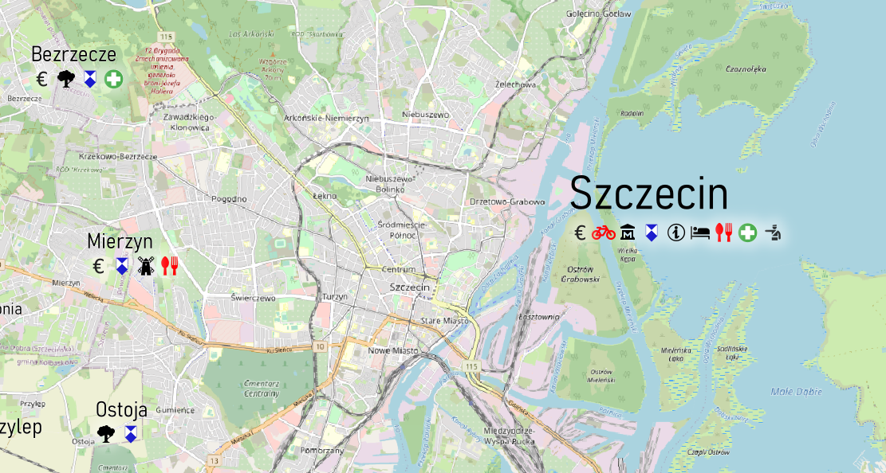
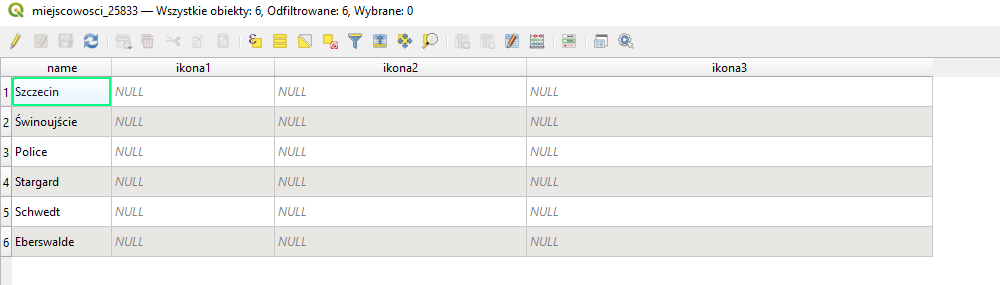
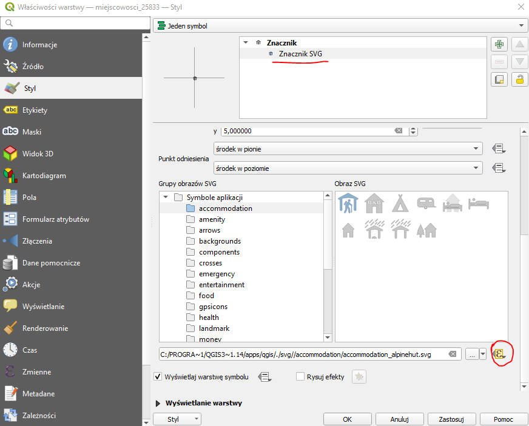
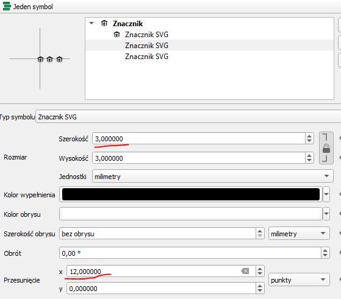
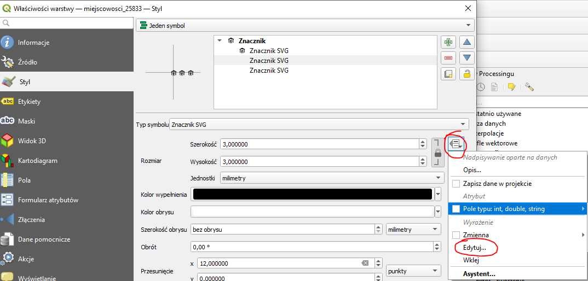
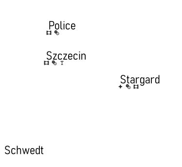

# 1. Opis
Procedura ustawiania dynamicznych ikon, które wyświetlane będą pod etykietą.

# 2. Warstwa
Warstwa, na podstawie której będziemy robić ikony musi zawierać pola dla każdej ikony. W polu wpisujemy jaka ikona będzie na którym miejscu. Na podstawie wartości w polu ikona1 wybrana zostanie ikona, która będzie się znajdowała na początku.

# 3. Styl
Ikony, które chcemy wyświetlić umieszczamy w folderze z projektem qgis (plik .qgs/.qgz) lub zamiast nazwy pliku podajemy do niego ścieżkę (lub URL).

1. Wchodzimy we ***właściwości*** i wybieramy zakładkę ***styl***.
2. Jako nasz znacznik wybieramy ***Znacznik SVG***. 
3. Klikamy ikonę w prawym dolnym rogu zaznaczoną na obrazku poniżej, następnie ***edytuj***
4. Wyświetli się okno do którego wpisujemy:

    ~~~~sql
    CASE
    when ikona1 = 'kino' then 'kino.svg'
    when ikona1 = 'teatr' then 'teatr.svg'
    when ikona1 = 'bar' then 'bar.svg'
    when ikona1 = 'szpital' then 'szpital.svg'
    END
    ~~~~

# 4. Wynik
Otrzymamy taki rezultat (na razie dla jednej ikony „kino”)

Aby wyświetlić więcej ikon dodajemy Znacznik SVG dla każdej z nich powtarzając kroki 3a – 3d zmieniając nazwę pola, z którego pobieramy informację (ikonaX).
Uzyskamy taki wynik:

Wszystkie ikony będą w jednym miejscu, więc musimy je przesunąć. Wybieramy przesunięcie na podstawie punktów w taki sposób żeby ikony na podglądzie były od siebie odsunięte.

Kolejnym problemem będzie to, że wyświetlają się domyślne ikony pomimo, że nie uzupełniliśmy pól ikona1, ikona2… Aby temu zapobiec musimy ustawić warunek, że jeżeli wartość pola ikonaX jest pusta (NULL) to rozmiar symbolu przyjmie wartość 0 (wtedy się nie wyświetli).

Wchodzimy we właściwości warstwy i wybieramy:

Następnie w okienku wpisujemy:

~~~~sql
CASE
  WHEN "ikona1" is not NULL
  THEN 3
  ELSE 0
END
~~~~

I powtarzamy dla każdej ikony. Dzięki temu ikony będą wyświetlały się tylko dla tych obiektów, dla których uzupełniliśmy odpowiednie atrybuty.

